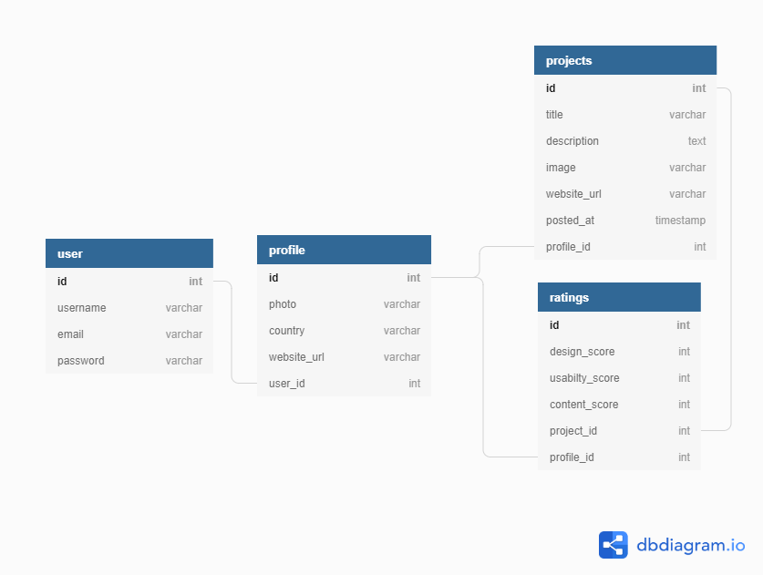

# Awwwards Replica 
## Description
This project is a replica of [www.awwwards.com](https://www.awwwards.com). As a user you can upload a web project and get reviewed based on usablity, design and content on the site

## Design
#### Database Implementation(Entity Relationship Diagram)


## Getting Started
To get started run this in a virtual environment:

```bash
  $ git clone https://github.com/HannesKimara/awwwards.git
  $ cd awwwards
  $ python -m pip install -r requirements.txt
```

You'll need to create a '.env' file with the following values replaced to match:
```bash
  SECRET_KEY=<YOUR_SECRET_KEY>
  DATABASE_URL=<YOUR_DATABASE_URL>
  DISABLE_COLLECTSTATIC=1
  CLOUDINARY_CLOUD_NAME=<YOUR_CLOUDINARY_CLOUD_NAME>
  CLOUDINARY_API_KEY=<YOUR_CLOUDINARY_API_KEY>
  CLOUDINARY_API_SECRET=<YOUR_CLOUDINARY_API_SECRET>
  ALLOWED_HOSTS=<YOUR_ALLOWED_HOSTS>
  EMAIL_USE_TLS=True
  EMAIL_HOST=<YOUR_EMAIL_HOST>
  EMAIL_PORT=587
  EMAIL_HOST_USER=<YOUR_EMAIL_ADDRESS>
  EMAIL_HOST_PASSWORD=<YOUR_EMAIL_PASSWORD>
  DEBUG=<BOOL>
```

Run migrations and start server:
```bash
$ python manage.py migrate
$ python manage.py runserver
```

## Testing
To run unittests run the following command in root directory:
```bash
$ python manage.py test
```
All tests should pass

## Author
This project was created and is maintained by Hannes Kimara

## License
This is licensed under MIT License Copyright(2020) Hannes Kimara